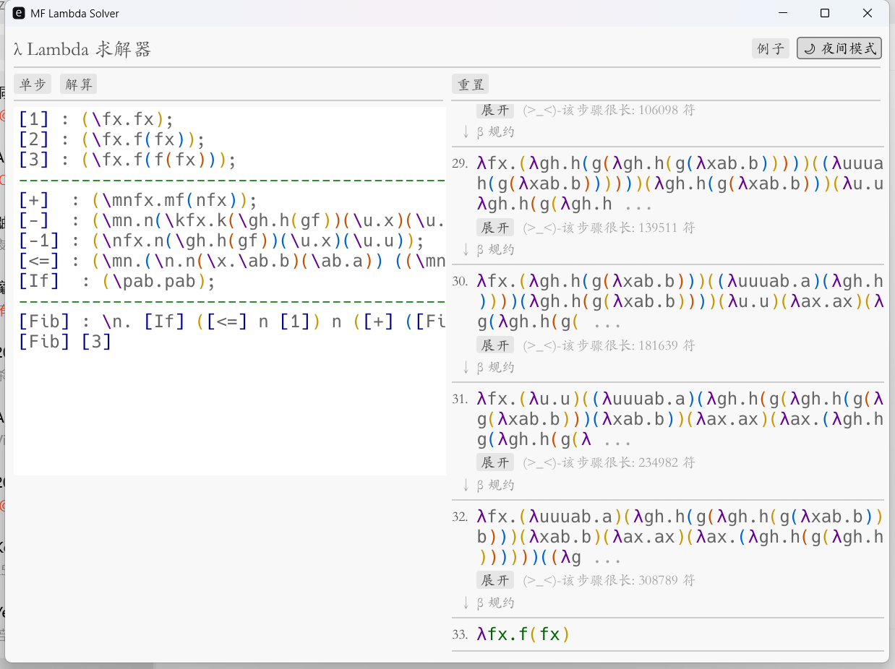
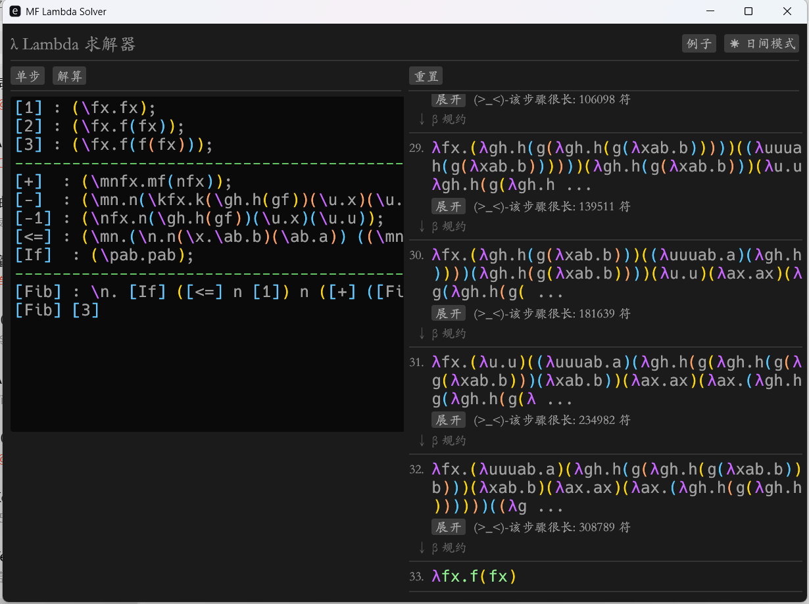

# MF Lambda λ Solver


> **享受Lambda中的乐趣**

<p align="center">
  
  
</p>

## ✨ 核心亮点
<p align="center">
  
</p>

### 1. 宏定义系统
告别手写枯燥的 `(\fx.f(f(x)))`！
本求解器支持类似编程语言的**宏定义**与**环境管理**。你可以像写函数一样定义逻辑，并在表达式中自由调用。
*   支持 **递归宏**（如阶乘、斐波那契数列）。
*   支持 **惰性展开**（Lazy Expansion），只有在计算需要时才展开宏，保持步骤清晰。

### 2. 性能
*   **智能截断**：对于超长的中间步骤（如 Church 数爆炸），自动折叠并仅渲染前缀，点击即可按需展开。
*   **Rust 驱动**：利用 Rust 的所有权机制和零成本抽象，核心归约算法极快。

### 3. 极佳的视觉体验
*   **彩虹括号**：自动为匹配的括号上色，一眼看穿 `(((\x.x)))` 的层级结构。
*   **语法高亮**：宏、注释、Lambda 清晰易读。
*   **日夜模式**：Material 风格的深色/浅色主题，一键切换。

---


## 🚀 快速上手 (Getting Started)

### 安装与运行

你需要安装 [Rust](https://www.rust-lang.org/) 

<p align="center">
  
</p>

```bash
# 克隆仓库
git clone https://github.com/Duo-Star/Lambda_solver.git
cd Lambda_solver

# 运行
cargo run --release
```
---

## 语法指南 (Syntax)

我们设计了一套符合直觉的语法，支持注释和分号分隔的定义。

### 1. 基础语法
*   **变量**: `x`, `y`, `a`
*   **Lambda**: `\x.x` 或 `\xy.x` (多参数缩写)
*   **应用**: `x y` (左结合)
*   **注释**: `-- 单行注释` 或 `--/ 多行注释 /`

### 2. 定义宏 (Macro Definition)
使用 `[Name]: Body;` 的格式（注意分号）。

```text
-- 定义数字 0 和 1
[0] : (\fx.x);
[1] : (\fx.fx);

-- 定义加法
[+] : (\mnfx.mf(nfx));
```

### 3. 主表达式
文件的最后一部分是要求解的表达式。

```text
-- 计算 1 + 1
[+] [1] [1]
```

---

## 💡 示例

复制以下代码到软件中体验：

### 基础逻辑
```text
[1] : (\fx.fx);
[2] : (\fx.f(fx));
[T] : \xy.x;
[F] : \xy.y;
[If] : \pab.pab;

-- 如果真，则返回 1，否则返回 2
[If] [T] [1] [2]
```

### 递归与算术
得益于宏系统，我们可以直观地定义递归逻辑：

斐波那契
```text
[1] : (\fx.fx);
[2] : (\fx.f(fx));
[3] : (\fx.f(f(fx)));
[+]  : (\mnfx.mf(nfx));
[-]  : (\mn.n(\kfx.k(\gh.h(gf))(\u.x)(\u.u))m);
[-1] : (\nfx.n(\gh.h(gf))(\u.x)(\u.u));
[<=] : (\mn.(\n.n(\x.\ab.b)(\ab.a)) ((\mn.n(\kfx.k(\gh.h(gf))(\u.x)(\u.u))m) m n));
[If]  : (\pab.pab);
[Fib] : \n. [If] ([<=] n [1]) n ([+] ([Fib] ([-1] n)) ([Fib] ([-] n [2])));
[Fib] [3]
```

---

## 📄 开源协议

[MIT](LICENSE.txt)  License
